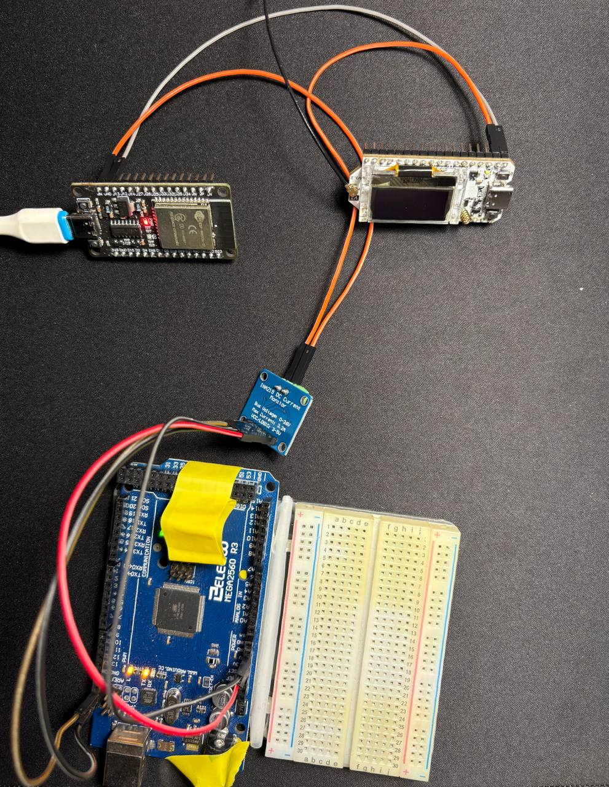

# IoT System with Adaptive Sampling using ESP32 and FreeRTOS

## Table of Contents
- [Overview](#overview)
  - [Features](#features)
- [System Architecture](#system-architecture)
  - [Hardware Components](#hardware-components)
  - [Software Components](#software-components)
- [Setup Instructions](#setup-instructions)
- [Implementation Details](#implementation-details)
  - [Input Signal](#input-signal)
  - [Sampling Frequency](#sampling-frequency)
  - [Aggregate Function Computation](#aggregate-function-computation)
  - [MQTT Communication](#mqtt-communication)
  - [LoRaWAN + TTN Communication](#lorawan--ttn-communication)
- [Performance Evaluation](#performance-evaluation)
  - [Energy Savings](#energy-savings)
  - [Data Transmission Volume](#data-transmission-volume)
  - [End-to-End Latency](#end-to-end-latency)
- [Bonus: Multiple Input Signals](#bonus-multiple-input-signals)

---

## Overview
This repository contains the source code and documentation for an **IoT system** designed to collect, process, and transmit sensor data efficiently using **adaptive sampling**. The system is built on **ESP32 with FreeRTOS**, utilizing **FFT** for signal analysis and dynamically adjusting the sampling frequency to save energy and reduce communication overhead.

### Features
- **Dynamic Sampling Frequency Adjustment**: Adjusts sampling rate based on signal frequency components.
- **FFT-based Analysis**: Uses Fast Fourier Transform to detect dominant frequencies.
- **Data Aggregation**: Computes average values over a moving time window.
- **Dual Communication**:
  - **WiFi (MQTT)**: Sends data to a local edge server.
  - **LoRaWAN + TTN**: Transmits data to the cloud.
- **Performance Metrics**: Includes energy savings, transmission volume, and latency measurement.

---

## System Architecture

### Hardware Components
- **ESP32 Development Board**
- **Heltec WiFi LoRa V3 Board** (with antenna)
- **Connections**:
  - `GPIO25 (ESP32)` → `GPIO07 (Heltec)`
  - `GND ↔ GND`
  - Use breadboard and jumper wires (or FF jumpers for direct connection)
  - Two USB cables
  - Arduino mega2560 board
  - INA219 board 
  - 8-10 jumpers

### Software Components
- **IDE for embedded systems**: Arduino IDE or PlatformIO
- **RTOS**: [FreeRTOS](https://www.freertos.org/)
- **Signal Processing**: [ArduinoFFT]
  - MQTT over WiFi ([configured Adafruit MQTT broker](https://io.adafruit.com/))
  - LoRaWAN via [TTN (The Things Network)](https://www.thethingsnetwork.org/). An application has been registered on TTN
  - AWS account

---

## Setup Instructions
1. **Clone this repository**
   ```bash
   git clone https://github.com/volpeffervescente/iot-adaptive-sampling.git
   ```
2. **Open the project in Arduino IDE or PlatformIO**
3. **Install required libraries**
   - ArduinoFFT
   - FreeRTOS (if using Arduino IDE, select ESP32 board with FreeRTOS)
4. **Configure MQTT and LoRaWAN settings** in the source files (secrets)
5. **Upload firmware** to the ESP32 board and to the Heltec WiFI LoRa V3 board
6. **Monitor the Serial output** for live logs and debug info

---

## Implementation Details

### Input Signal
Generated by the ESP32 DAC on `GPIO25`.
The input signal consists of 3+ different signal like this one
```math
2 \cdot \sin(2\pi \cdot 3t) + 4 \cdot \sin(2\pi \cdot 5t)
```


### Sampling Frequency
- **Max Sampling Rate**: 34.10 kHz (ADC on `GPIO07` of Heltec)
- **Optimal Sampling**: 

***Adaptive Sampling***: The system starts oversampling (16 kHz) and continuously adjusts the sampling frequency based on the Nyquist theorem, 
using FFT to identify the dominant frequency in the signal.
Multitasking with FreeRTOS: The program is structured into three concurrent tasks:
SamplingTask: Samples the analog signal and optionally detects significant changes.
ProcessingTask: Computes the FFT and adjusts the sampling frequency.
MonitorTask: (Optional) Displays runtime metrics (sampling rate, heap usage, stack watermark) on the serial console and OLED display.

***FFT Support***:
arduinoFFT: compatible FFT library.
ESP-DSP: Optimized FFT library leveraging the ESP32's hardware acceleration (included, not used by default).

***Synchronization and Parallelism***: 
Instead of traditional semaphores, this project implements **double-buffering** to safely share data between tasks. Two alternating buffers (`bufferA` and `bufferB`) are used to decouple data acquisition from FFT processing:
- While `SamplingTask` fills one buffer with fresh data,
- `ProcessingTask` concurrently processes the other buffer.
- The roles are swapped after each cycle using a boolean flag, ensuring safe and efficient parallel execution.

Signal Change Detection (Experimental)
A statistical trigger based on mean and standard deviation is optionally available to detect abrupt changes in the input signal and initiate FFT recomputation. However, it comes with limitations:
- It may not detect gradual variations.
- Adds computation overhead and latency.
- Can cause misalignment between batches.

This mechanism is disabled by default in favor of simpler and more robust alternatives, such as interrupts or threshold-based detection.


### Aggregate Function Computation
- computing the average over a sliding window implemented with a **circular buffer**
- Defined in `windowCode`

### MQTT Communication
- Aggregated data (avg) sent to local edge server via MQTT
- "optimalSamplingWithFFT.ino" code exploited to compute this task
- "windowCode.ino" code exploited to compute this task
- adafruit topic is volpeffervescente/feed/avg 
- MQTT broker setup required (e.g., Mosquitto)

### LoRaWAN + TTN Communication
- LoRaWAN configuration from [Heltec LoRaWAN connectivity repository](https://github.com/HelTecAutomation/Heltec_ESP32/tree/master)
- Aggregated data (avg) sent to cloud via LoRa
- "windowCode" exploited to compute this task
- end device registration (Heltec WiFi LoRa V2 since V3 not available) required on TTN. 
- end device credentials (such as devEUI, appKey, appEUI) given after the registration on TTN app must be copied and pasted in the OTAA section of source code 'LoRaWan'

## Performance Evaluation

### Energy Savings
Compares adaptive sampling vs. fixed over-sampling  

# Adaptive Sampling + MQTT + Deep Sleep Overview

This project combines **adaptive sampling** (using FFT), **sliding window averaging**, **MQTT communication**, and **deep sleep mode** to optimize energy efficiency.

## Workflow

1. **WiFi and MQTT Connection**  
   The ESP32 wakes up and reconnects to WiFi and the Adafruit IO MQTT broker.

2. **Signal Sampling**  
   It samples 64 points from the analog input pin at a dynamic sampling frequency, initially set at 16 kHz.

3. **FFT Calculation (if necessary)**  
   If a significant signal variation is detected based on mean and standard deviation, the FFT is recalculated, and the sampling frequency is adapted according to the Nyquist theorem.

4. **Sliding Window Averaging**  
   A sliding window of 50 samples is used to compute the average value, reducing noise and data fluctuations.

5. **MQTT Publishing**  
   The averaged value and timestamp are published to the MQTT broker, allowing monitoring and RTT (Round Trip Time) latency measurement.

6. **Deep Sleep Activation**  
   After completing data acquisition and transmission, the ESP32 enters deep sleep mode for 5 seconds to minimize power consumption. Upon waking, it restarts the workflow from `setup()`.

## Flowchart

```plaintext
+----------------+
| Wake Up        |
+----------------+
        |
        v
+----------------+
| Connect WiFi   |
| and MQTT       |
+----------------+
        |
        v
+---------------------------+
| Sample Signal             |
| (adaptive frequency)      |
+---------------------------+
        |
        v
+----------------------------+
| FFT Analysis (if needed)   |
+----------------------------+
        |
        v
+----------------------------+
| Calculate Sliding Avg      |
+----------------------------+
        |
        v
+----------------------------+
| Publish to MQTT            |
+----------------------------+
        |
        v
+----------------------------+
| Deep Sleep (5 seconds)     |
+----------------------------+
        |
        v
(restart setup)
```

## Highlights

- Full **energy saving** strategy thanks to periodic deep sleep cycles.
- **Adaptive sampling** based on signal analysis reduces unnecessary data collection.
- **MQTT-based monitoring** with integrated latency measurement using acknowledgment messages.
- Designed for **IoT low-power scenarios** with optimized signal fidelity and reduced communication overhead.


### Setup and Hardware Configuration

The system is composed of multiple boards connected as follows:

- **Signal Generator & power supply**: ESP32 DevKit module using the internal DAC to generate an analog waveform, and also acts as power supply for the load.
- **Main Acquisition Node - Load**: Heltec WiFi LoRa V3 board reads the analog signal from the ESP32 through ADC and runs the source code.
- **Energy Consumption Monitoring**: Arduino Mega 2560 connected to an INA219 sensor measures the current and voltage drawn by the Heltec board.

### Connection Details

- **ESP32 DAC Output (GPIO25)** → **Heltec ADC Input (GPIO7)**
- **INA219 Module**:
  - V+ connected to power supply (VCC)
  - V- connected to Heltec VCC pin (powering the Heltec board)
  - SDA/SCL connected to Arduino Mega 2560 for I2C communication

The INA219 measures real-time power consumption, allowing detailed analysis of the energy profile during different operations (sampling, FFT computation, MQTT transmission, deep sleep).



**Results**: 
Adaptive Sampling is expected to significantly reduce energy usage. Since data is sampled and transmitted only when necessary, the microcontroller and communication modules can stay in low-power modes longer. This is especially beneficial in low-activity scenarios.
Fixed Oversampling results in higher and constant energy consumption, as the system continuously samples and transmits data, regardless of its relevance.


### Data Transmission Volume
Evaluates reduction in data size using adaptive sampling  
**Results**: 
Adaptive Sampling reduces the amount of data sent over the network by adjusting the amount of data transmitted, and so avoiding redundant transmissions. This lowers network load and can improve overall system scalability.

Fixed Oversampling generates a high volume of data, including many unnecessary or repeated values, leading to increased bandwidth usage and storage requirements.

It has to be considered that: since the goal of this project is to send a single aggregate value every x seconds (e.g. 5 seconds) over Wi-Fi or LoRa, the volume of data transmitted over the network is not increasing if fixed oversampling technique is chosen over adaptive sampling.  

### End-to-End Latency
Measures latency from data generation to reception at edge server. 

#### **End-to-End Latency Measurement**

To accurately assess the end-to-end latency of the system over Wi-Fi, a timestamping mechanism is used directly on the ESP32. The idea is to account not only for network delays but also for any small processing overhead on the receiving side. Note that latency depends on network conditions and other internal pc factors.  

#### **Measurement Procedure**

1. **ESP32 (Publisher)**
   - Every time an aggregated average value is ready, the ESP32 records the current timestamp using `millis()`.
   - It then publishes a message containing the timestamp to the MQTT topic:  
     `"volpeffervescente/feeds/avg"` (hosted on Adafruit IO).
   - The ESP32 subscribes to an echo topic to listen for the returned message.

2. **External Listener (PC or Cloud Client)**
   - A client (e.g., a PC using `mosquitto_sub`) subscribes to `"volpeffervescente/feeds/avg"`.
   - Upon receiving a message, it immediately captures the reception timestamp and publishes back to the `"echoAck"` topic, appending its own processing time.
  


  Example command for the client:
   ```bash
   mosquitto_sub -h io.adafruit.com -p 1883 -u "volpeffervescente" -P "AIO_KEY" -t "volpeffervescente/feeds/avg" | while read line; do
   mosquitto_pub -h io.adafruit.com -p 1883 -u "volpeffervescente" -P "AIO_KEY" -t "volpeffervescente/feeds/echoAck" -m "ack"
  done
   ```
  Example command for the external client:
   ```bash
   mosquitto_sub -h io.adafruit.com -p 1883 -u "volpeffervescente" -P "AIO_KEY" -t "volpeffervescente/feeds/echoAck"
  done
   ```

**Results**: 


Note: one-way latency is estimated by dividing the RTT by two.

---

## Bonus: Multiple Input Signals
For the bonus assignment, the generation of at least 3 different input signals (some with low frequency and low amplitude, others with high frequency and high amplitude, ecc...) is performed by the DAC of the ESP32 board. This assignment is merged with the signal generation assignment, in the 'sigGen' source code.   


How different types of an input signal may affect the overall performance in the case of adaptive sampling vs basic/over-sampling: 
_

---
